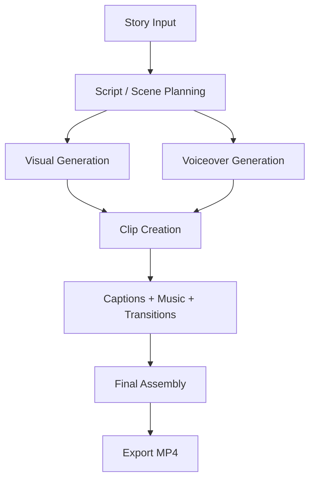

# AI Faceless Reel Generator

An end-to-end AI video pipeline that turns a short story into a **vertical, social-media-ready reel** with scene planning, voiceover, captions, visuals, background music, and final video assembly.

This project is built to be:
- **repeatable** — the same story can be generated again with the same workflow,
- **modular** — each stage can be tested or replaced independently,
- **fallback-friendly** — local/free options are used when cloud APIs are unavailable,
- **review-friendly** — the output folder makes it easy to inspect the generated reel and the steps that created it.

---

## Table of Contents

- [Overview](#overview)
- [How the Pipeline Works](#how-the-pipeline-works)
- [Tech Stack](#tech-stack)
- [Repository Structure](#repository-structure)
- [Setup](#setup)
- [Configuration](#configuration)
- [How to Run](#how-to-run)
- [Output Files](#output-files)
- [Troubleshooting](#troubleshooting)
- [Limitations](#limitations)
- [Future Improvements](#future-improvements)
- [License](#license)

---

## Overview

The goal of this project is to automate the creation of short-form video content from text.

Instead of manually writing a script, searching for footage, recording narration, timing captions, and editing everything together, the pipeline handles the complete workflow:

1. take a story as input,
2. convert it into a structured scene plan,
3. generate or fetch visuals,
4. generate voiceover,
5. create captions,
6. add music and transitions,
7. export a final MP4 reel.

The project is especially useful for:
- faceless content creation,
- viral-style business storytelling,
- short reels for Instagram, TikTok, and YouTube Shorts,
- demonstrating an AI-powered media workflow in an assignment or portfolio setting.

---

## How the Pipeline Works



### Step 1: Story Input
The pipeline begins with a story. This can be:
- one of the pre-written story templates,
- or a custom story written by the user.

The story usually contains:
- a hook,
- a narrative arc,
- a core lesson,
- a target audience,
- and the emotional tone.

### Step 2: Scene / Script Planning
The story is converted into a structured script, usually split into scenes.

Each scene can include:
- scene number,
- shot type,
- visual description,
- voiceover text,
- camera motion,
- overlay text,
- and emotional intent.

This structure is important because it lets the rest of the pipeline work in a predictable way.

### Step 3: Visual Generation
Depending on the selected mode, the project can use:
- **faceless stock visuals** for a B-roll style reel,
- or **AI-generated visuals / talking-head style clips** if that mode is enabled.

The project uses fallback logic so that if one engine fails, another one can be used.

### Step 4: Voiceover Generation
The narration is generated using text-to-speech.

The audio stage is important because it drives:
- pacing,
- caption timing,
- scene duration,
- and final edit rhythm.

### Step 5: Caption Generation
The pipeline can create word-synced captions so the current word is highlighted as the narration plays.

This improves readability and makes the reel feel more like modern short-form content.

### Step 6: Video Assembly
All assets are combined into a final reel:
- visuals,
- voiceover,
- captions,
- music,
- transitions,
- and export settings.

### Step 7: Export
The final result is saved as an MP4 file in the session output folder.

---

## Tech Stack

The project is built with a mix of local tools, optional cloud APIs, and Python video libraries.

### Core
- **Python**
- **Streamlit** — interactive UI
- **MoviePy** — video compositing and editing
- **FFmpeg** — encoding and audio/video processing

### AI / LLM
- **Ollama** — local LLM inference for script generation
- **Qwen / similar local model** — used for structured script output, depending on your setup

### Audio
- **edge-tts** — text-to-speech generation
- **audio mixing tools** — for narration and background music layering

### Visuals
- **Pexels API** — stock footage / B-roll retrieval
- **AI image/video providers** — optional cloud or local generation depending on configuration
- **Pillow** — image processing, overlays, and text rendering

### Optional Integrations
- **Google Drive API** — upload final output to Drive
- **Cloud model providers** — for higher-quality generation when keys are available

---

## Repository Structure

The exact structure may vary slightly, but the project is organized around these main parts:

```text
.
├── app.py
├── generate_video.py
├── config.py
├── requirements.txt
├── stories/
├── pipeline/
├── assets/
├── outputs/
├── docs/
├── test_pipeline.py
└── README.md
```

### Main files

**`app.py`**  
Streamlit UI for the full reel-generation workflow.

**`generate_video.py`**  
CLI entry point for running the pipeline without the UI.

**`config.py`**  
Central place for paths, provider settings, feature flags, style presets, and constants.

**`pipeline/`**  
Contains the actual implementation of the workflow:
- script generation
- image generation
- audio generation
- video generation
- assembly
- provider integration

**`stories/`**  
Story templates and input content used by the pipeline.

**`assets/`**  
Reference images, music, and other static resources.

**`outputs/`**  
Generated reels and intermediate artifacts, usually saved per session.

**`docs/`**  
Project notes, workflow explanations, or supporting documentation.

**`test_pipeline.py`**  
Smoke test to verify that the pipeline components are working.

---

## Setup

### 1) Prerequisites

Install the following first:

- **Python 3.11+**
- **Git**
- **FFmpeg**
- **Ollama** (if you want local LLM generation)
- **A browser** for the Streamlit UI

Optional, depending on your setup:
- **GPU with CUDA** for faster local generation
- **API keys** for external providers

### 2) Clone the repository

```bash
git clone https://github.com/Manshu555/Ai-video-generation-pipeline.git
cd Ai-video-generation-pipeline
```

### 3) Create a virtual environment

**Windows**
```bash
python -m venv venv
venv\Scripts\activate
```

**macOS / Linux**
```bash
python3 -m venv venv
source venv/bin/activate
```

### 4) Install dependencies

```bash
pip install --upgrade pip
pip install -r requirements.txt
```

If your project needs PyTorch with CUDA, install the version that matches your machine.

### 5) Install FFmpeg

Make sure `ffmpeg` is available in your terminal:

```bash
ffmpeg -version
```

If not installed:
- on Windows, use `winget`, `choco`, or a manual FFmpeg install,
- on macOS, use `brew install ffmpeg`,
- on Linux, use your package manager.

### 6) Install Ollama

If you are using local script generation:

1. install Ollama,
2. start the Ollama service,
3. pull the model used by the project.

Example:

```bash
ollama pull qwen2.5:7b
```

### 7) Create the environment file

Create a `.env` file from your template or manually add the keys you use.

```env
PEXELS_API_KEY=your_key_here
FAL_KEY=your_key_here
ELEVENLABS_API_KEY=your_key_here
HEDRA_API_KEY=your_key_here
GOOGLE_DRIVE_CREDENTIALS_FILE=credentials.json
```

All keys may not be required. The pipeline is designed to fall back to local or free alternatives where possible.

---

## Configuration

Most project settings should live in `config.py`.

Common settings usually include:

- input/output paths
- model names
- style presets
- visual mode
- voice settings
- provider priority
- fallback options
- resolution and export settings

Typical examples:

- **Story source**: template story or custom story
- **Visual mode**: faceless stock footage or AI-driven visuals
- **Voice**: narrator voice selection
- **Output resolution**: vertical 9:16 reel format
- **Export format**: MP4

If you change a provider, model, or style, update the configuration instead of hardcoding values in multiple files.

---

## How to Run

### Option 1: Streamlit UI

```bash
streamlit run app.py
```

Use the UI when you want:
- a guided workflow,
- previews of generated assets,
- manual control over scene edits,
- and export/upload options.

### Option 2: CLI

```bash
python generate_video.py
```

Use the CLI when you want:
- fast repeat runs,
- automation,
- or headless generation without the browser UI.

---

## Output Files

The pipeline saves intermediate and final files in a session folder under `outputs/`.

Example:

```text
outputs/session_YYYYMMDD_HHMMSS/
├── script.json
├── images/
├── audio/
├── clips/
├── final/
└── logs/
```

### What each folder contains

**`script.json`**  
The generated scene plan and voiceover text.

**`images/`**  
Scene images or visual assets.

**`audio/`**  
Voiceover MP3 files and any timing metadata used for captions.

**`clips/`**  
Per-scene video clips before final assembly.

**`final/`**  
The final exported reel.

**`logs/`**  
Optional logs or debug information.

---

## Troubleshooting

### Ollama model not found
Make sure Ollama is installed and the required model has been pulled.

### FFmpeg error
Check that `ffmpeg` is installed and accessible from the command line.

### Missing API key
If you are using a cloud provider, ensure the relevant key is added to `.env`.

### Slow generation
This can happen when:
- running on CPU,
- using large local models,
- or generating multiple visual stages.

### Empty output or failed clip
Check:
- the generated script,
- the scene prompt,
- the voiceover text,
- and the console logs.

---

## Limitations

This project is still subject to practical limits:

- story-to-video quality depends on the input prompt and selected provider,
- local generation can be slow on low-VRAM machines,
- stock footage availability depends on search relevance,
- lip-sync or character consistency may vary across scenes,
- some cloud services may require paid keys.

---

## Future Improvements

Possible improvements include:

- stronger script planning,
- better scene-to-scene consistency,
- improved lip-sync,
- smarter fallback selection,
- more caption styles,
- batch generation,
- and more export presets.

---

## License

Add your preferred license here, such as MIT or Apache-2.0.

---

## Notes

This README is written to explain both:
- **how to set up and run the project**, and
- **how the pipeline works internally**.

That makes it easier for reviewers, recruiters, and future contributors to understand the system without reading every file first.
