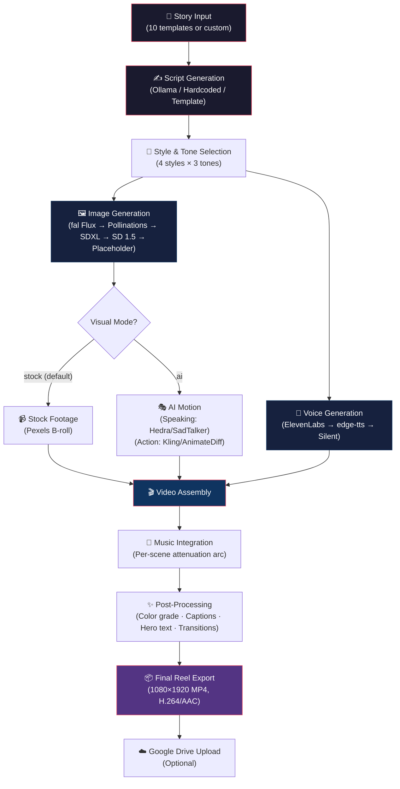
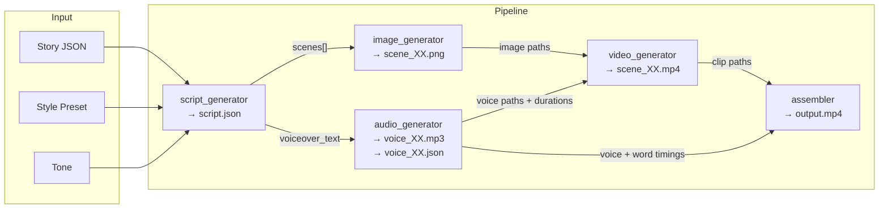

<](https://www.python.org/)
[](https://streamlit.io/)
[](LICENSE)
[](https://developer.nvidia.com/cuda-toolkit)
[](https://ffmpeg.org/)

*Built for the BreakoutAI Assignment · Designed to run fully local ($0 cost) or scale to cloud APIs for state-of-the-art quality*

</div>

---

## Table of Contents

- [1. Project Overview](#1-project-overview)
- [2. Architecture Overview](#2-architecture-overview)
- [3. Detailed Pipeline Explanation](#3-detailed-pipeline-explanation)
- [4. Technology Stack](#4-technology-stack)
- [5. Repository Structure](#5-repository-structure)
- [6. Installation Guide](#6-installation-guide)
- [7. Configuration](#7-configuration)
- [8. Usage Guide](#8-usage-guide)
- [9. Example Walkthrough](#9-example-walkthrough)
- [10. Output Directory Explanation](#10-output-directory-explanation)
- [11. Engineering Decisions](#11-engineering-decisions)
- [12. Current Limitations](#12-current-limitations)
- [13. Future Improvements](#13-future-improvements)
- [14. Performance Considerations](#14-performance-considerations)
- [15. Troubleshooting Guide](#15-troubleshooting-guide)
- [16. Screenshots & Demo](#16-screenshots--demo)
- [17. Contributor Notes](#17-contributor-notes)
- [18. License](#18-license)

---

## 1. Project Overview

### The Problem

Creating short-form viral business reels — the kind that dominate Instagram, TikTok, and LinkedIn — requires expensive software, video editing expertise, stock footage subscriptions, professional voiceover talent, and hours of manual work per reel. Small creators and entrepreneurs are priced out.

### Why This Was Built

This pipeline was built as a **BreakoutAI Round 2 assignment** to demonstrate that an end-to-end AI system can take a raw business story and autonomously produce a polished, captioned, narrated vertical reel — with zero manual editing and zero cost by default.

### End Goal

A fully automated, modular pipeline that:

1. **Accepts** a business story (from a curated library of 10 stories or custom user input)
2. **Generates** a cinematically planned 5-scene screenplay (hook → conflict → escalation → lesson → payoff)
3. **Produces** scene visuals (AI-generated images or real stock footage)
4. **Narrates** with natural TTS voiceover and word-synced kinetic captions
5. **Assembles** everything into a 1080×1920 H.264/AAC reel with color grading, transitions, music, and title cards
6. **Exports** a ready-to-upload MP4

### Key Capabilities

| Capability | Description |
|:---|:---|
| **Two Visual Modes** | `stock` (faceless B-roll from Pexels — default) or `ai` (AI character with lip-sync) |
| **Dual Interface** | 8-step Streamlit wizard **and** headless CLI (`generate_video.py`) |
| **Cascade Architecture** | Every stage has a cloud → local → free fallback chain; an empty `.env` runs the entire pipeline at $0 |
| **Cinematic Post-Processing** | Per-emotion cold→warm color arc, film grain, light leak, vignette, crossfades, hero-text climax typography |
| **Kinetic Captions** | Word-by-word reveal synced to TTS timestamps, newest word highlighted in gold |
| **GPU-Accelerated Encoding** | NVENC (hardware) encoding when available, libx264 CPU fallback |
| **10 Pre-Written Stories** | Curated viral business stories with hooks, lessons, audiences, and emotional arcs |
| **Google Drive Upload** | One-click export to Google Drive from the Streamlit UI |

---

## 2. Architecture Overview

### End-to-End Workflow Diagram



### High-Level System Design

The system is organized into three layers:

```
┌──────────────────────────────────────────────────────────────┐
│                    ORCHESTRATION LAYER                        │
│         app.py (Streamlit)  ·  generate_video.py (CLI)       │
├──────────────────────────────────────────────────────────────┤
│                    PIPELINE LAYER                             │
│  script_generator → image_generator → audio_generator        │
│  → video_generator → assembler → drive_uploader              │
├──────────────────────────────────────────────────────────────┤
│                    PROVIDER LAYER                             │
│  fal_provider (Flux/Kling/Audio) · hedra_provider (Lip-sync) │
│  eleven_provider (TTS) · pexels_provider (Stock footage)     │
└──────────────────────────────────────────────────────────────┘
```

### Data Flow Between Modules



### Component Interaction

1. **Script Generator** produces a structured `scenes[]` array (5 scenes with visual descriptions, voiceover text, camera motions, emotions, and stock queries)
2. **Image Generator** renders each scene as a 1080×1920 PNG using the style prefix + character description
3. **Audio Generator** creates per-scene MP3 voiceovers with word-level timestamp JSON files
4. **Video Generator** routes each scene by `shot_type` and `VISUAL_MODE` to the appropriate motion engine
5. **Assembler** composites everything: per-scene color grading → cinematic FX → title cards → kinetic captions → hero text → crossfades → music arc → final H.264 encode

---

## 3. Detailed Pipeline Explanation

### Stage 1: Story Input

| Detail | Value |
|:---|:---|
| **Input** | User selects from 10 pre-written stories (`stories/templates.json`) or writes a custom story |
| **Processing** | `story_manager.py` loads the JSON templates; custom stories are constructed from form fields (title, hook, raw story, core lesson, audience, emotional arc) |
| **Output** | A story dictionary: `{id, title, hook, raw_story, core_lesson, target_audience, emotional_arc, tags}` |
| **Why** | Pre-written stories provide reliable, tested inputs; custom stories enable extensibility |

Each story is designed with a **viral hook**, a **narrative arc**, and a **core lesson** — the raw ingredients for a punchy 30-second reel.

---

### Stage 2: Script Generation

| Detail | Value |
|:---|:---|
| **Input** | Story dict, tone (`dramatic` / `educational` / `motivational`), style preset |
| **Processing** | Three-tier cascade: (1) hardcoded screenplay for story 1, (2) Ollama LLM with structured JSON output schema, (3) deterministic template fallback |
| **Model** | Ollama `qwen2.5:7b` (local, 7.6B parameters, constrained via JSON schema) |
| **Output** | `script.json` — array of 5 scene objects |
| **Why** | Local LLM avoids cloud costs; structured output schema guarantees valid JSON; hardcoded screenplay for the showcase story ensures reliability |

**Scene object structure:**
```json
{
  "scene_number": 1,
  "shot_type": "speaking",
  "duration_seconds": 5.5,
  "visual_description": "looking directly at camera with quiet regret...",
  "voiceover_text": "He built a successful construction company...",
  "stock_query": "empty upscale restaurant interior evening",
  "camera_motion": "slow push-in",
  "text_overlay": "THE HEIST",
  "emotion": "tension",
  "hero_text": false,
  "music_attenuation": -28.0,
  "motion_prompt": ""
}
```

**Safety mechanisms:**
- Ollama output is validated against a strict JSON schema (`minItems: 5`, `maxItems: 5`, required fields)
- Scripts with empty or too-short voiceovers (`<5 words`) are **rejected and retried** (up to 3 attempts)
- `_normalize()` guarantees every field exists with sensible defaults
- Empty `voiceover_text` is back-filled from the story's `core_lesson` or `hook`

---

### Stage 3: Scene Planning

| Detail | Value |
|:---|:---|
| **Input** | The 5-scene script |
| **Processing** | Each scene is automatically tagged with `shot_type` ("speaking" or "action"), routing it to the correct motion engine later |
| **Output** | Enriched scenes with `stock_query`, `camera_motion`, `emotion`, `hero_text` flags, and `music_attenuation` values |
| **Why** | Separating speaking from action scenes allows specialized rendering: lip-sync for faces, motion effects for environments |

**Emotional arc design (Story 1):**
```
S1 HOOK        → S2 THE CRIME   → S3 THE COST    → S4 THE LINE ★  → S5 COMEBACK
warm amber       cold blue        desat. grey       contrast gold     full gold
tension          shock            dramatic          revelation        triumph
```

---

### Stage 4: Prompt Engineering

| Detail | Value |
|:---|:---|
| **Input** | Scene visual descriptions + style preset |
| **Processing** | `_build_prompt()` combines style prefix + character description + scene description into a single optimized prompt; `no_character` scenes omit the character |
| **Output** | A concise, CLIP-safe prompt string (kept under 77 tokens for SD 1.5 compatibility) |
| **Why** | SD 1.5's CLIP encoder truncates at 77 tokens — every word counts; negative prompts handle quality control separately |

**Prompt template:**
```
{style_prefix}, featuring {character_description}, {visual_description},
vertical 9:16 composition, cinematic lighting, ultra detailed, sharp focus
```

**Negative prompt (shared):**
```
blurry, low quality, watermark, text, logo, multiple people, distorted face,
extra limbs, bad anatomy, ugly, deformed, out of frame, cropped
```

---

### Stage 5: Image Generation

| Detail | Value |
|:---|:---|
| **Input** | Engineered prompt + negative prompt |
| **Processing** | **5-tier fallback cascade:** fal Flux (cloud) → Pollinations Flux (free API) → Local SDXL (GPU) → Local SD 1.5 (GPU) → PIL gradient placeholder |
| **Models** | `fal-ai/flux/dev`, Pollinations.ai Flux, `stabilityai/stable-diffusion-xl-base-1.0`, `runwayml/stable-diffusion-v1-5` |
| **Output** | `images/scene_XX.png` — 1080×1920 PNG per scene |
| **Why** | Multi-tier cascade ensures images are always produced regardless of API availability or GPU memory; Pollinations is free and produces Flux-quality results |

**SDXL configuration (local):**
- Resolution: 768×1344 (native SDXL 9:16), resized to 1080×1920
- Steps: 30, Guidance: 7.5, Seed: 42 (deterministic)
- VAE slicing + attention slicing enabled for 8 GB VRAM
- `release_image_pipeline()` frees VRAM before the motion stage

---

### Stage 6: Video / Clip Generation

| Detail | Value |
|:---|:---|
| **Input** | Scene images, voiceover audio, style, target durations |
| **Processing** | Routes by `VISUAL_MODE` and `shot_type` through the appropriate motion cascade |
| **Output** | `clips/scene_XX.mp4` per scene |

**Faceless Mode (default: `VISUAL_MODE="stock"`):**
```
Pexels stock footage (by stock_query) → Ken Burns on still → Static clip
```

**AI Character Mode (`VISUAL_MODE="ai"`):**
```
Speaking scenes: Hedra Character-3 → SadTalker lip-sync → Ken Burns
Action scenes:   fal Kling i2v → ModelScope T2V → AnimateDiff → Ken Burns
```

**Ken Burns implementation features:**
- 7 camera motions: `slow push-in`, `pan left`, `pan right`, `tilt up`, `tilt down`, `static hold`, `zoom out`
- Smooth cubic ease-in-out interpolation
- Per-emotion color grading
- Dark circular vignette overlay
- GPU (NVENC) or CPU (libx264) encoding

---

### Stage 7: Voice Generation

| Detail | Value |
|:---|:---|
| **Input** | `voiceover_text` from each scene |
| **Processing** | **2-tier cascade:** ElevenLabs (premium narration + word timestamps) → edge-tts (free, with WordBoundary events) |
| **Models** | ElevenLabs `eleven_multilingual_v2`, Microsoft edge-tts neural voices |
| **Output** | `audio/voice_XX.mp3` + `audio/voice_XX.json` (word-level timings) per scene |
| **Why** | edge-tts is completely free with no API key; word-level timestamps enable synchronized kinetic captions |

**Voice options (edge-tts):**
| Voice | ID |
|:---|:---|
| Guy (warm male) | `en-US-GuyNeural` |
| Davis (authoritative male) | `en-US-DavisNeural` |
| Aria (professional female) | `en-US-AriaNeural` |
| Jenny (friendly female) | `en-US-JennyNeural` |

**Resilience:**
- 4 retry rounds with increasing backoff (2s, 5s, 8s, 11s)
- Falls back through all 4 voice alternatives
- Silent MP3 fallback as last resort
- Self-healing: timings-less files are regenerated on re-run

---

### Stage 8: Caption Generation

| Detail | Value |
|:---|:---|
| **Input** | `voiceover_text` + word timing JSON files |
| **Processing** | `_build_caption_stages()` creates progressive word-reveal images; assembler composites them at the correct timestamps |
| **Output** | Word-by-word animated captions at the bottom of each frame |
| **Why** | Kinetic captions (the "karaoke" effect) are the signature look of viral reels — they improve retention and accessibility |

Caption rendering:
- Semi-transparent dark rounded-rectangle background
- White text with black stroke for readability
- Latest word highlighted in **gold (#FFD73C)**
- Positioned at 78% of frame height

---

### Stage 9: Music Integration

| Detail | Value |
|:---|:---|
| **Input** | Optional music track from `assets/music/` or generated via fal Stable Audio |
| **Processing** | Music is looped/trimmed to match reel duration; per-scene attenuation creates a **dynamic music arc** |
| **Output** | Composite audio track mixed under voiceover |
| **Why** | Per-scene attenuation creates dramatic tension: the music drops to near-silence (−50 dB) during the Scene 4 climax, then swells back for the resolution |

**Music attenuation arc (Story 1):**
```
S1: -28 dB (tension bed)
S2: -28 dB (continued bed)
S3: -28 dB (continued bed)
S4: -50 dB (near-silence for hero text climax)
S5: -22 dB (warm resolution swell)
```

---

### Stage 10: Video Assembly

| Detail | Value |
|:---|:---|
| **Input** | All clips, voice tracks, word timings, scenes metadata, music |
| **Processing** | MoviePy v2 compositing with cinematic post-processing |
| **Output** | `final/output.mp4` — 1080×1920, 30 FPS, H.264 + AAC |
| **Why** | Central assembly point applies a consistent visual treatment across all motion engines |

**Post-processing pipeline per frame:**
1. **Zoom punch** — quick scale-in at scene start (6% over 0.3s, eased)
2. **Color grading** — per-emotion RGB multipliers from `COLOR_GRADES`
3. **Cinematic FX** — film grain (Gaussian noise) + pulsing warm light-leak (upper-right radial glow)
4. **Title card** — gold ALL-CAPS text on semi-transparent bar at top (5% of height)
5. **Kinetic captions** — word-by-word reveal at bottom (78% of height)
6. **Hero text** (Scene 4 only) — full-frame darkened background, line 1 fades in, line 2 words punch in one-by-one in gold at 112pt
7. **Transitions** — fade-in on first scene (0.3s), crossfade between scenes (0.15s), fade-out on last scene (0.3s)

---

### Stage 11: Final Reel Export

| Detail | Value |
|:---|:---|
| **Input** | Assembled composite video |
| **Processing** | NVENC GPU encoding (or libx264 CPU fallback), AAC audio at 192 kbps |
| **Output** | `output.mp4` (also copied to project root for easy access) |
| **Why** | NVENC is 3-5× faster than CPU encoding on supported GPUs |

**Encoding settings:**
| Codec | Preset | Quality |
|:---|:---|:---|
| `h264_nvenc` (GPU) | `fast` | Hardware-accelerated |
| `libx264` (CPU) | `slow` | CRF 18 (high quality) |

---

## 4. Technology Stack

### Programming Languages

| Language | Role |
|:---|:---|
| **Python 3.11+** | Core pipeline logic, AI model integration, video processing |
| **Batch (.bat)** | Windows automation scripts for environment setup and execution |

### AI / ML Models

| Model | Purpose | Size | Provider |
|:---|:---|:---|:---|
| **Qwen 2.5:7b** | Script generation (structured JSON scenes) | 7.6B params | Ollama (local) |
| **Stable Diffusion XL 1.0** | High-quality scene illustration (primary) | 6.9 GB | HuggingFace (local GPU) |
| **Stable Diffusion 1.5** | Scene illustration (smaller fallback) | ~4 GB | HuggingFace (local GPU) |
| **Flux** | State-of-the-art image generation | Cloud | fal.ai / Pollinations.ai |
| **SadTalker** | Talking-head lip-sync animation | ~2 GB checkpoints | Local (isolated venv) |
| **AnimateDiff** | Text-to-video motion (opt-in) | ~1.7 GB adapter | HuggingFace (local GPU) |
| **ModelScope T2V** | Text-to-video motion (opt-in) | ~3.5 GB | HuggingFace (local GPU) |
| **Stable Video Diffusion** | Image-to-video animation (opt-in) | ~5 GB | HuggingFace (local GPU) |
| **Kling v2.1** | Cinematic image-to-video | Cloud | fal.ai |
| **Hedra Character-3** | Premium talking-photo lip-sync | Cloud | Hedra API |
| **ElevenLabs v2** | Premium narration + word timestamps | Cloud | ElevenLabs API |
| **GFPGAN** | Face enhancement for SadTalker output | ~340 MB | Bundled with SadTalker |

### Frameworks & Libraries

| Library | Version | Role |
|:---|:---|:---|
| **Streamlit** | ≥1.35.0 | Interactive 8-step wizard UI |
| **MoviePy** | ≥2.0.0 | Video compositing, concatenation, effects |
| **Diffusers** | ≥0.30.0 | HuggingFace pipeline for SD/SDXL/AnimateDiff/SVD |
| **Transformers** | ≥4.40.0 | Model tokenizers and configuration |
| **Accelerate** | ≥0.30.0 | GPU memory optimization (model CPU offloading) |
| **edge-tts** | ≥7.0.0 | Free Microsoft neural TTS with WordBoundary events |
| **PyDub** | ≥0.25.1 | Audio mixing, looping, attenuation |
| **Pillow** | ≥10.0.0 | Image manipulation, text rendering, compositing |
| **PyTorch** | 2.x (CUDA 12.4) | GPU inference for all local AI models |

### Video & Audio Processing

| Tool | Role |
|:---|:---|
| **FFmpeg** | Backend encoder for MoviePy (H.264/NVENC, AAC) |
| **NVENC** | GPU-accelerated H.264 encoding (NVIDIA GPUs) |
| **edge-tts** | Text-to-speech with per-word timing extraction |
| **pydub** | Audio ducking, looping, and mixing for music beds |

### APIs & External Services

| Service | Role | Cost |
|:---|:---|:---|
| **Pexels** | Stock video footage for faceless B-roll | Free |
| **Pollinations.ai** | Free Flux image generation API | Free |
| **fal.ai** | Flux images, Kling video, Stable Audio music | Paid (free trial) |
| **ElevenLabs** | Premium narration with word-level timestamps | Paid (free tier: 10K chars/mo) |
| **Hedra** | Character-3 talking-photo lip-sync | Paid (free tier: ~50s/mo) |
| **Google Drive API** | Optional one-click upload for final reels | Free |
| **Ollama** | Local LLM inference server | Free (local) |

### Storage & Configuration

| Component | Role |
|:---|:---|
| **`.env`** | API keys (all optional, gitignored) |
| **`config.py`** | Central configuration: paths, model IDs, style presets, color grades, feature flags |
| **`stories/templates.json`** | 10 curated viral business story templates |
| **`assets/`** | Character reference photos, style references, music tracks |
| **`outputs/`** | Per-session output directories (images, audio, clips, final video) |

---

## 5. Repository Structure

```
Ai-video-generation-pipeline/
│
├── app.py                          # Streamlit 8-step wizard UI
├── generate_video.py               # Headless CLI entry point
├── config.py                       # Central configuration (models, paths, feature flags)
├── requirements.txt                # Python dependencies
├── .env.example                    # Template for API keys (all optional)
├── .gitignore                      # Excludes outputs, secrets, personal photos
│
├── pipeline/                       # Core pipeline modules
│   ├── __init__.py
│   ├── script_generator.py         # LLM script generation (Ollama/template/hardcoded)
│   ├── image_generator.py          # Multi-tier image generation cascade
│   ├── audio_generator.py          # TTS voiceover + word timing extraction
│   ├── video_generator.py          # Motion routing (stock/lip-sync/AnimateDiff/Ken Burns)
│   ├── assembler.py                # Final reel compositing + post-processing
│   ├── lipsync_generator.py        # SadTalker integration (isolated subprocess)
│   ├── animatediff_generator.py    # AnimateDiff motion engine (opt-in)
│   ├── modelscope_generator.py     # ModelScope T2V engine (opt-in)
│   ├── svd_generator.py            # Stable Video Diffusion engine (opt-in)
│   ├── story_manager.py            # Story template loading + display helpers
│   ├── drive_uploader.py           # Google Drive upload integration
│   └── providers/                  # Cloud API providers (all key-gated + fallback-safe)
│       ├── __init__.py
│       ├── fal_provider.py         # fal.ai: Flux images, Kling video, Stable Audio
│       ├── hedra_provider.py       # Hedra Character-3 talking-photo lip-sync
│       ├── eleven_provider.py      # ElevenLabs TTS + word-level timestamps
│       └── pexels_provider.py      # Pexels stock footage for faceless B-roll
│
├── stories/
│   └── templates.json              # 10 curated viral business stories
│
├── assets/
│   ├── character_refs/             # Reference photos for consistent character rendering
│   │   └── bob_clean.jpg           # Clean single-subject portrait (for SadTalker)
│   ├── style_refs/                 # Style reference images (reserved)
│   └── music/                      # Background music tracks (.mp3/.wav)
│
├── outputs/                        # Generated output sessions (gitignored)
│   └── session_YYYYMMDD_HHMMSS/
│       ├── script.json             # Generated screenplay
│       ├── images/                 # Scene illustrations (PNG)
│       ├── audio/                  # Voiceover MP3 + word timing JSON
│       ├── clips/                  # Animated scene clips (MP4)
│       └── final/                  # Final assembled reel
│
├── docs/
│   └── workflow_explanation.md     # Detailed technical changelog and workflow docs
│
├── test_pipeline.py                # Full pipeline smoke test (7 checks)
├── test_modelscope_scene.py        # Single-scene ModelScope test
├── test_motion_scene.py            # Single-scene motion engine test
├── test_svd_scene.py               # Single-scene SVD test
├── test_talk_scene.py              # Single-scene SadTalker lip-sync test
├── download_sdxl.py                # One-time SDXL model download script
├── setup_sadtalker.py              # Automated SadTalker installation (isolated venv)
├── setup_venv.bat                  # Windows venv setup automation
├── install_and_generate.bat        # Full setup + video generation batch script
└── run_app.bat                     # Quick-launch Streamlit app
```

### Key File Purposes

| File | Purpose |
|:---|:---|
| `app.py` | Main Streamlit interface. 8-step wizard with session state management, preview panels for images/clips/audio, and inline editing of scene scripts. |
| `generate_video.py` | CLI entry point. Configurable story ID, style, tone, voice at the top. Supports `RESUME_SESSION` for partial re-rendering. |
| `config.py` | **Single source of truth** for all configuration: API keys, model IDs, style presets (`pixar_3d`, `comic_book`, `cinematic`, `flat_motion`), color grades, TTS voices, video dimensions, feature flags (`USE_CLOUD_PROVIDERS`, `VISUAL_MODE`, etc.). |
| `pipeline/script_generator.py` | Manages the Ollama LLM call with structured JSON output schema. Contains the hand-directed `_DISHWASHER_SCRIPT` for story 1, the deterministic template fallback, and the `_normalize()` hardening function. |
| `pipeline/image_generator.py` | 5-tier image cascade with VRAM management. Caches the SDXL/SD1.5 pipeline globally and exposes `release_image_pipeline()` to free GPU memory before the motion stage. |
| `pipeline/video_generator.py` | Central routing logic. Dispatches each scene to the correct motion engine based on `VISUAL_MODE` and `shot_type`. Contains the Ken Burns implementation with 7 camera motions and cinematic effects. |
| `pipeline/assembler.py` | The most complex module. Handles kinetic captions, hero text typography, color grading, cinematic FX (grain + light leak), zoom punches, crossfades, per-scene music attenuation, and NVENC encoding. |
| `pipeline/audio_generator.py` | TTS cascade with retry logic, word timing extraction via edge-tts `WordBoundary` events, self-healing regeneration, and music track discovery. |
| `pipeline/lipsync_generator.py` | Runs SadTalker as a subprocess in its own isolated venv (separate from the main diffusers environment to avoid dependency conflicts). |
| `pipeline/providers/` | Cloud API clients. Every function returns `False`/`None` on any error — **never raises** — so callers degrade gracefully. |

---

## 6. Installation Guide

### Prerequisites

| Requirement | Version | Purpose |
|:---|:---|:---|
| **Python** | 3.11+ | Runtime |
| **NVIDIA GPU** | 8+ GB VRAM | Local AI model inference (RTX 3060 or better recommended) |
| **CUDA Toolkit** | 12.4 | GPU acceleration |
| **FFmpeg** | Latest | Video encoding backend |
| **Ollama** | Latest | Local LLM server (for script generation) |
| **Git** | Latest | Repository cloning |

### Step 1: Clone the Repository

```bash
git clone https://github.com/Manshu555/Ai-video-generation-pipeline.git
cd Ai-video-generation-pipeline
```

### Step 2: Create Virtual Environment

```bash
python -m venv venv

# Windows
venv\Scripts\activate

# Linux/Mac
source venv/bin/activate
```

### Step 3: Install PyTorch with CUDA

```bash
# CUDA 12.4 (adjust for your CUDA version)
pip install torch torchvision --index-url https://download.pytorch.org/whl/cu124
```

> **Verify GPU:** `python -c "import torch; print(torch.cuda.is_available(), torch.cuda.get_device_name(0))"`

### Step 4: Install Dependencies

```bash
pip install -r requirements.txt
```

### Step 5: Install FFmpeg

**Windows (via winget):**
```bash
winget install FFmpeg
```

**Windows (via Chocolatey):**
```bash
choco install ffmpeg
```

**Linux:**
```bash
sudo apt install ffmpeg
```

**macOS:**
```bash
brew install ffmpeg
```

> **Verify:** `ffmpeg -version`

### Step 6: Install and Configure Ollama

1. Download from [ollama.ai](https://ollama.ai)
2. Install and start the server
3. Pull the required model:

```bash
ollama pull qwen2.5:7b
```

> **Verify:** `curl http://localhost:11434/api/tags` should list `qwen2.5:7b`

### Step 7: Download AI Models (Optional, First-Run Auto-Downloads)

**SDXL (6.9 GB — one-time download):**
```bash
python download_sdxl.py
```

**SadTalker (for AI character lip-sync mode):**
```bash
python setup_sadtalker.py
```

### Step 8: Configure API Keys

```bash
cp .env.example .env
```

Edit `.env` with any keys you have (all are optional):

```env
# Free — powers the default faceless B-roll flow
PEXELS_API_KEY=your_pexels_key

# Optional premium upgrades
FAL_KEY=your_fal_key
ELEVENLABS_API_KEY=your_elevenlabs_key
HEDRA_API_KEY=your_hedra_key
```

### Step 9: Verify Installation

```bash
python test_pipeline.py
```

Expected output:
```
=======================================================
  Pipeline Smoke Test
=======================================================
[PASS] CUDA: NVIDIA GeForce RTX 4060 (8.0 GB VRAM)
[PASS] SDXL weights found
[PASS] NVENC GPU encoding available
[PASS] Ollama qwen2.5:7b: 'OK'
[PASS] Image gen: 842 KB at scene_01.png
[PASS] Ken Burns: 196 KB, 3s clip generated
[PASS] edge-tts: 47 KB MP3
=======================================================
  Results: 7/7 passed
=======================================================
```

---

## 7. Configuration

### Environment Variables (`.env`)

| Variable | Required | Default | Description |
|:---|:---|:---|:---|
| `PEXELS_API_KEY` | Recommended | — | Free stock footage for faceless B-roll ([Get key](https://www.pexels.com/api/)) |
| `FAL_KEY` | Optional | — | fal.ai: Flux images + Kling video + Stable Audio ([Get key](https://fal.ai/dashboard/keys)) |
| `ELEVENLABS_API_KEY` | Optional | — | Premium narration + word timestamps ([Get key](https://elevenlabs.io/app/settings/api-keys)) |
| `ELEVENLABS_VOICE_ID` | Optional | `pNInz6obpgDQGcFmaJgB` (Adam) | Override narrator voice ID |
| `ELEVENLABS_MODEL` | Optional | `eleven_multilingual_v2` | Override TTS model |
| `HEDRA_API_KEY` | Optional | — | Character-3 talking-photo lip-sync ([Get key](https://www.hedra.com/)) |
| `GEMINI_API_KEY` | Optional | — | Legacy/future Gemini integration |
| `REPLICATE_API_TOKEN` | Optional | — | Legacy/future Replicate integration |
| `GOOGLE_DRIVE_CREDENTIALS_FILE` | Optional | `credentials.json` | Path to Google Drive OAuth credentials |

### Feature Flags (`config.py`)

| Flag | Default | Description |
|:---|:---|:---|
| `VISUAL_MODE` | `"stock"` | `"stock"` = faceless Pexels B-roll; `"ai"` = AI character + lip-sync |
| `USE_CLOUD_PROVIDERS` | `False` | Master switch for paid AI services (fal/Hedra/ElevenLabs) |
| `PREFER_FAL_IMAGE` | `True` | Use fal Flux for still images (when cloud is enabled) |
| `PREFER_FAL_VIDEO` | `True` | Use fal Kling for action scene motion (when cloud is enabled) |
| `PREFER_HEDRA` | `True` | Use Hedra Character-3 for speaking scenes (when cloud is enabled) |
| `PREFER_ELEVENLABS` | `True` | Use ElevenLabs for narration (when cloud is enabled) |
| `PREFER_FAL_MUSIC` | `False` | Generate music via Stable Audio (when cloud is enabled) |
| `USE_ANIMATEDIFF` | `False` | Enable AnimateDiff for action scenes (high VRAM usage) |
| `USE_MODELSCOPE` | `False` | Enable ModelScope text-to-video (256×256, watermarked) |

### Local vs Cloud Execution

| Mode | Config | What Runs | Cost |
|:---|:---|:---|:---|
| **Fully Local** | `USE_CLOUD_PROVIDERS=False`, no `.env` keys | SD 1.5/SDXL images, Ken Burns motion, edge-tts voice | **$0** |
| **Free APIs** | Add `PEXELS_API_KEY` only | Pexels stock footage + edge-tts voice | **$0** |
| **Hybrid** | Add any cloud keys + `USE_CLOUD_PROVIDERS=True` | Cloud engines for stages with keys, local fallback for others | **Pay-per-use** |
| **Full Cloud** | All keys + `USE_CLOUD_PROVIDERS=True` | Flux images, Kling motion, Hedra lip-sync, ElevenLabs voice | **$$** |

### Performance Settings

| Setting | Location | Default | Effect |
|:---|:---|:---|:---|
| `VIDEO_FPS` | `config.py` | 30 | Output frame rate |
| `VIDEO_WIDTH × HEIGHT` | `config.py` | 1080 × 1920 | Output resolution (9:16 vertical) |
| `CLIP_DURATION_TARGET` | `config.py` | 9 seconds | Target duration per scene clip |
| `SCENE_SPEECH_RATE` | `config.py` | `-5%` | edge-tts speaking pace (slower = more gravity) |
| `MUSIC_VOLUME_DB` | `config.py` | -22 dB | Default background music attenuation |
| `SDXL_CACHE_DIR` | `config.py` | `D:/models/sd` | HuggingFace model cache location |

---

## 8. Usage Guide

### Streamlit Workflow

**Launch:**
```bash
streamlit run app.py
```
Or use the batch file (Windows): `run_app.bat`

**Step-by-Step UI Flow:**

| Step | Screen | What Happens |
|:---|:---|:---|
| **1. Story** | Select from 10 pre-written stories or write a custom story with title, hook, full story, lesson, audience, and emotional arc | Story is stored in session state |
| **2. Style & Tone** | Choose visual style (Pixar 3D / Comic Book / Cinematic Dark / Flat Motion) and narrative tone (Dramatic / Educational / Motivational) | Controls prompt engineering for all downstream stages |
| **3. Script** | View and edit the generated 5-scene script — modify visual descriptions, voiceover text, camera motions, and text overlays inline | Script is saved as `script.json`; changes persist |
| **4. Images** | View generated scene illustrations in a 4-column grid; redo individual scenes with one click | Failed images show as "generation failed" with retry button |
| **5. Clips** | Watch animated scene clips; voiceovers are generated first (needed for lip-sync/duration) | Shows clip type per scene (talking head / motion / stock) |
| **6. Audio** | Select narrator voice, choose background music track, preview individual scene voiceovers | Voiceovers can be regenerated with a different voice |
| **7. Assemble** | Watch the full assembled reel with captions, transitions, color grading, and music | Shows file size; can go back to adjust audio |
| **8. Export** | Download the final MP4; optionally upload to Google Drive; start a new session | Download button + Drive upload with shareable link |

### CLI Workflow

**Configure and run:**

Edit the constants at the top of `generate_video.py`:
```python
STORY_ID  = 1              # 1-10 (from templates.json)
TONE      = "dramatic"     # dramatic | educational | motivational
STYLE_KEY = "cinematic"    # cinematic | pixar_3d | comic_book | flat_motion
VOICE     = "en-US-GuyNeural"
```

**Execute:**
```bash
python generate_video.py
```

**Output:**
```
============================================================
  Breakout AI — Viral Reel Generator
============================================================

Story  : The Dishwasher Steak Heist
Style  : Cinematic Dark
Tone   : dramatic
Voice  : en-US-GuyNeural

Output : outputs/session_20260614_222130
------------------------------------------------------------

[1/5] Generating script with Ollama...
      5 scenes
[2/5] Generating scene images (SDXL GPU -> SD 1.5 -> Pollinations)...
      5 images ready
[3/5] Generating voiceovers (edge-tts)...
      5 voiceovers ready
[4/5] Animating scenes (Hedra/Kling cloud -> local fallback)...
      5 clips ready
[5/5] Assembling final reel...

============================================================
  DONE! Video saved to:
  outputs/session_20260614_222130/final/output.mp4
============================================================
```

**Resume a partial session:**
```python
RESUME_SESSION = "session_20260614_222130"  # reuse cached assets
REUSE_CACHED_CLIPS = True                   # skip re-rendering clips
```

Delete specific `clips/scene_XX.mp4` or `images/scene_XX.png` files to force regeneration of only those scenes.

---

## 9. Example Walkthrough

### Input Story: "The Dishwasher Steak Heist"

```json
{
  "title": "The Dishwasher Steak Heist",
  "hook": "His restaurant was failing... then he found out his dishwasher was
           throwing premium steaks in the dumpster.",
  "core_lesson": "He didn't have a restaurant problem. He had an ego problem.",
  "emotional_arc": "shock → recognition → lesson → hope"
}
```

### Generated Script (5 Scenes)

| Scene | Shot Type | Emotion | Text Overlay | Voiceover |
|:---|:---|:---|:---|:---|
| 1 | Speaking | Tension | THE HEIST | "He built a successful construction company. Then he opened a restaurant. It was gone in eight months." |
| 2 | Action | Shock | THE THEFT | "Every night, his dishwasher threw premium steaks into the dumpster, to sneak back and steal them. Bob never knew." |
| 3 | Action | Dramatic | THE COST | "He was buried in the numbers. Too proud to truly know his own people. So he never saw it coming." |
| 4 | Speaking | Revelation | *(hero text)* | "He didn't have a restaurant problem. He had an ego problem." |
| 5 | Speaking | Triumph | THE COMEBACK | "He read every book on hospitality. He listened. His next restaurant earned rave reviews around the world." |

### Scene Prompts (Generated)

**Scene 2 (Action — no character):**
```
Cinematic photorealistic photograph, dramatic moody lighting, deep shadows,
rich detail, interior of a commercial restaurant kitchen at night, stainless
steel counters, raw premium steaks on a tray, an open back door to a dark
alley with a large metal dumpster, overhead fluorescent lighting, cinematic
wide establishing shot, empty, no people, vertical 9:16 composition,
cinematic lighting, ultra detailed, sharp focus
```

### Generated Assets

```
outputs/session_20260614_222130/
├── script.json                    # 5-scene screenplay
├── images/
│   ├── scene_01.png               # Speaking portrait (warm amber lighting)
│   ├── scene_02.png               # Empty kitchen (cold blue mood)
│   ├── scene_03.png               # Lone figure in empty restaurant
│   ├── scene_04.png               # Extreme close-up (Rembrandt lighting)
│   └── scene_05.png               # Warm restaurant interior
├── audio/
│   ├── voice_01.mp3 + voice_01.json   # "He built a successful..."
│   ├── voice_02.mp3 + voice_02.json   # "Every night, his dishwasher..."
│   ├── voice_03.mp3 + voice_03.json   # "He was buried in the numbers..."
│   ├── voice_04.mp3 + voice_04.json   # "He didn't have a restaurant..."
│   └── voice_05.mp3 + voice_05.json   # "He read every book..."
├── clips/
│   ├── scene_01.mp4               # Talking head / stock footage
│   ├── scene_02.mp4               # Kitchen pan / stock footage
│   ├── scene_03.mp4               # Empty restaurant / stock footage
│   ├── scene_04.mp4               # Close-up / stock footage
│   └── scene_05.mp4               # Warm restaurant / stock footage
└── final/
    └── output.mp4                 # 🎬 Final assembled reel (~38s)
```

### Final Reel Characteristics

- **Duration:** ~38 seconds (voice-driven, no dead-air tails)
- **Resolution:** 1080×1920 (9:16 vertical)
- **Format:** H.264 video + AAC audio
- **Color arc:** Warm amber → cold blue → desaturated grey → contrast gold → full warm gold
- **Climax moment (Scene 4):** Music drops to -50 dB, frame darkens, "HE DIDN'T HAVE A" fades in at 54pt, then "EGO PROBLEM." punches in word-by-word at 112pt gold

---

## 10. Output Directory Explanation

Each pipeline run creates a timestamped session directory:

```
outputs/session_20260614_222130/
```

| Directory / File | Contents | Format |
|:---|:---|:---|
| `script.json` | Complete 5-scene screenplay with all metadata | JSON |
| `images/` | Scene illustrations (AI-generated or placeholder) | `scene_XX.png` (1080×1920) |
| `audio/` | Voiceover recordings | `voice_XX.mp3` (MP3, 44.1 kHz) |
| `audio/` | Word-level timing data for kinetic captions | `voice_XX.json` (array of `{word, start, end}`) |
| `clips/` | Animated scene clips (stock footage, Ken Burns, lip-sync, etc.) | `scene_XX.mp4` (1080×1920, 30 FPS) |
| `final/` | Assembled final reel with all post-processing | `output.mp4` (H.264/AAC) |
| `temp_audio.m4a` | Temporary audio file during assembly (auto-deleted) | M4A |

### Artifact Lifecycle

1. **Images** are generated once and cached — delete `images/scene_XX.png` to force regeneration
2. **Audio** files include JSON word timings alongside the MP3 — timings-less files are auto-regenerated
3. **Clips** depend on both images and audio — regenerating either requires clip regeneration
4. **Final** reel is re-assembled from all clips, audio, and metadata on each assembly step

---

## 11. Engineering Decisions

### Why Ollama + Qwen 2.5:7b for Script Generation?

The pipeline needed **structured JSON output** (not free-form text). Ollama's `format` parameter accepts a full JSON Schema that constrains the LLM to output exactly a 5-element array of scene objects. The 7B model is significantly more reliable at strict JSON than the 3B variant (`llama3.2:3b`) which was tested first and frequently returned malformed output. Local inference means **no cloud cost** and **no rate limits**. The pipeline is model-agnostic — any Ollama-compatible model can be swapped by changing `OLLAMA_MODEL` in `config.py`.

### Why the Multi-Tier Image Cascade?

Real-world reliability demands graceful degradation:

1. **fal Flux** — state-of-the-art quality but requires a paid API key
2. **Pollinations.ai** — free Flux-quality images via public API, no key needed
3. **Local SDXL** — high quality on GPU, but 6.9 GB download required
4. **Local SD 1.5** — smaller model, faster download, weaker at complex scenes
5. **PIL placeholder** — styled gradient image, always works, no GPU needed

This ensures the pipeline **never fails** regardless of network availability, API balance, or GPU capability.

### Why Ken Burns Over AnimateDiff as Default?

AnimateDiff is a **text-to-video** model that generates new frames from the prompt — it does not animate the existing still. On 8 GB VRAM, it produced low-coherence grain textures that were worse than a cinematic Ken Burns effect on a good still image. Ken Burns preserves the curated image quality while adding professional camera motion with cubic easing.

### Why SadTalker in an Isolated Venv?

SadTalker's dependency tree (basicsr, facexlib, gfpgan, old NumPy/SciPy versions) conflicts with the main pipeline's modern diffusers stack. Running it as a **subprocess with its own Python interpreter** avoids all dependency conflicts while still enabling GPU-accelerated lip-sync. The `setup_sadtalker.py` script handles cloning, venv creation, dependency installation, compatibility patching, and checkpoint downloading.

### Why Per-Scene Music Attenuation?

A flat music bed under narration sounds amateurish. Real film scoring uses **dynamic mixing** — the music dips under dialogue and swells during visual moments. The pipeline's per-scene `music_attenuation` value creates a proper arc: tension bed (−28 dB) under narrated scenes, near-silence (−50 dB) for the climax hero text, and warm resolution (−22 dB) for the payoff.

### Why edge-tts WordBoundary Instead of SentenceBoundary?

edge-tts 7.x defaults to `boundary="SentenceBoundary"` which produces only ~2 timing events per scene — useless for word-by-word captions. Explicitly requesting `boundary="WordBoundary"` yields per-word start/end times that enable the "karaoke-style" kinetic caption effect that is signature to viral reels.

### Cost vs Quality Trade-offs

| Approach | Quality | Cost | Latency |
|:---|:---|:---|:---|
| Full local (default) | Good | $0 | 5-15 min/reel |
| Pexels + edge-tts | Very Good | $0 | 3-8 min/reel |
| fal + ElevenLabs + Hedra | Excellent | ~$2-5/reel | 5-10 min/reel |

---

## 12. Current Limitations

### Scene-to-Scene Character Consistency

In `VISUAL_MODE="ai"`, speaking scenes use the **real reference photo** (via SadTalker) while action scenes use **SD/SDXL-generated character images**. There is no local face-consistency engine, so the character's appearance can shift between scenes. Mitigation: Hedra + fal Flux character-ref (cloud, paid) provide much better consistency.

### Character Lip-Sync Quality

SadTalker produces head motion + mouth movement from audio, but the output is 256×256 (or 512×512 with enhancement), upscaled to 1080×1920. Face enhancement via GFPGAN helps, but the result is not photorealistic. Hedra Character-3 (cloud) produces significantly better results.

### LLM Script Reliability

The local `qwen2.5:7b` model (7.6B parameters) sometimes produces weak or malformed scripts — empty voiceover text, invalid JSON structures, or generic scenes that don't match the input story. The pipeline handles this with retry logic, validation, normalization, and template fallback, but a stronger LLM (GPT-4, Claude, or a larger local model) would improve script quality.

### Stock Footage Limitations (Faceless Mode)

Pexels search results depend on the `stock_query` text and available footage. Some abstract concepts or very specific scenes may not have good portrait-orientation matches. The pipeline falls back to Ken Burns on the AI-generated still when no suitable stock clip is found.

### Runtime Constraints

- First run downloads 6.9 GB (SDXL) + model weights; subsequent runs use cached models
- SD 1.5/SDXL inference on 8 GB VRAM requires careful memory management (`enable_model_cpu_offload`, `enable_vae_slicing`)
- AnimateDiff and ModelScope are disabled by default because they struggle on 8 GB VRAM
- Total pipeline runtime is 5-15 minutes depending on engines used

### Known Edge Cases

- `OSError: [WinError 6] The handle is invalid` at teardown — harmless MoviePy GC issue on Windows
- HuggingFace xet downloader panics on low RAM — disabled via `HF_HUB_DISABLE_XET=1`
- Pollinations.ai returns HTTP 402 when free quota is exhausted — falls back to local SD

---

## 13. Future Improvements

### High Priority

| Improvement | Impact | Complexity |
|:---|:---|:---|
| **Character LoRA / Flux character-ref** | Perfect identity consistency across all scenes | Medium |
| **ElevenLabs voice clone** | Branded narration with a custom voice | Low |
| **Quality Agent loop** | Auto-score each stage output and retry with refined prompts | Medium |
| **Batch production queue** | Overnight bulk reel generation for all 10 stories | Medium |

### Medium Priority

| Improvement | Impact | Complexity |
|:---|:---|:---|
| **Stronger LLM integration** | More reliable + creative scripts (GPT-4 / Claude API) | Low |
| **Music generation** | AI-generated custom scores matching emotional arc | Low |
| **Multi-language support** | edge-tts supports 75+ languages | Low |
| **Video-to-video refinement** | Use img2img on Ken Burns frames for style consistency | Medium |

### Stretch Goals

| Improvement | Impact | Complexity |
|:---|:---|:---|
| **Real-time preview** | WebSocket-based live preview during generation | High |
| **A/B testing framework** | Generate multiple versions, track performance | High |
| **Social media auto-posting** | Direct publish to Instagram, TikTok, YouTube Shorts | Medium |
| **Analytics dashboard** | Track reel performance across platforms | High |

---

## 14. Performance Considerations

### GPU Usage

| Operation | VRAM Usage | GPU | Notes |
|:---|:---|:---|:---|
| SDXL inference | ~6.5 GB | Required | VAE slicing + attention slicing enabled |
| SD 1.5 inference | ~4 GB | Required | Smaller model, faster inference |
| SadTalker | ~4 GB | Required | Runs in isolated process |
| AnimateDiff | ~7 GB | Required | Model CPU offload enabled; disabled by default |
| ModelScope T2V | ~6 GB | Required | Model CPU offload enabled; opt-in |
| NVENC encoding | Minimal | Optional | 3-5× faster than CPU encoding |
| Ken Burns | 0 | No GPU | Pure CPU image manipulation |

### CPU Fallback

All GPU operations gracefully fall back to CPU-compatible alternatives:
- **Image generation:** Falls through to Pollinations.ai (no GPU needed) or PIL placeholder
- **Video encoding:** `libx264` CPU encoder replaces NVENC
- **Motion:** Ken Burns uses CPU-only PIL transforms

### Memory Requirements

| Mode | RAM | VRAM | Storage |
|:---|:---|:---|:---|
| **Minimal (faceless + Pexels)** | 8 GB | 0 GB | 2 GB |
| **Local SD 1.5** | 8 GB | 4+ GB | 6 GB |
| **Local SDXL** | 16 GB | 8+ GB | 12 GB |
| **Full local (SDXL + SadTalker)** | 16 GB | 8+ GB | 16 GB |
| **ModelScope (opt-in)** | 16 GB + 10 GB free | 8+ GB | 20 GB |

### Runtime Expectations

| Configuration | Time per Reel | Bottleneck |
|:---|:---|:---|
| Pexels stock + edge-tts | 3-5 minutes | Pexels API download |
| Local SD 1.5 + Ken Burns + edge-tts | 5-10 minutes | Image generation (~15s/scene) |
| Local SDXL + Ken Burns + edge-tts | 8-15 minutes | SDXL inference (~30s/scene) |
| Cloud (fal + ElevenLabs + Hedra) | 5-10 minutes | Hedra generation (~2-3 min/scene) |

---

## 15. Troubleshooting Guide

### Common Errors and Fixes

| Error | Cause | Fix |
|:---|:---|:---|
| `torch.cuda.is_available()` returns `False` | PyTorch installed without CUDA support | `pip install torch torchvision --index-url https://download.pytorch.org/whl/cu124` |
| `[Image] SDXL still downloading — skipping` | SDXL weights haven't finished downloading | Run `python download_sdxl.py` and wait for completion |
| `[Script] Ollama failed, using template script` | Ollama server not running or model not pulled | Start Ollama: `ollama serve` then `ollama pull qwen2.5:7b` |
| `[fal] ... Exhausted balance / 403` | fal.ai credits depleted | Expected — pipeline falls back to local engines automatically |
| `[Image] Pollinations 402` | Free Flux API quota hit | Falls back to local SDXL/SD 1.5 automatically |
| `[Audio] All TTS attempts failed` | Network issue or edge-tts service disruption | Check internet connection; pipeline retries 4 rounds with backoff; worst case uses silent audio that self-heals on re-run |
| `[SadTalker] inference failed` | Face not detected in source image or memory error | SadTalker auto-retries with clean reference photo; falls back to Ken Burns |
| `OSError: [WinError 6] The handle is invalid` | MoviePy reader GC teardown on Windows | **Harmless** — video is already saved; ignore this error |
| `memory allocation ... failed` (HF xet) | HuggingFace xet downloader OOM | Already disabled via `HF_HUB_DISABLE_XET=1` in config; if persists, close apps to free RAM |
| `KMP_DUPLICATE_LIB_OK` warning | NumPy + torch OpenMP library conflict on Windows | Already handled in `config.py` with `os.environ.setdefault("KMP_DUPLICATE_LIB_OK", "TRUE")` |

### Quick Diagnostic Commands

```bash
# Check GPU
python -c "import torch; print(f'CUDA: {torch.cuda.is_available()}, GPU: {torch.cuda.get_device_name(0)}')"

# Check NVENC
ffmpeg -hide_banner -encoders 2>&1 | findstr nvenc

# Check Ollama
curl http://localhost:11434/api/tags

# Check edge-tts
python -c "import edge_tts; print('edge-tts OK')"

# Full smoke test
python test_pipeline.py
```

### Log Interpretation Guide

| Log Pattern | Meaning |
|:---|:---|
| `Scene N OK (Pexels stock footage)` | Successfully fetched stock B-roll from Pexels |
| `Scene N OK (Pollinations Flux)` | Free Flux API generated the image |
| `Scene N OK (local SDXL GPU)` | Local SDXL produced the image |
| `Scene N OK (Ken Burns fallback)` | Higher-tier engines failed; cinematic zoom/pan applied |
| `Scene N OK (SadTalker lip-sync)` | Talking-head video generated with mouth sync |
| `Script: Attempt N: empty/too-short voiceover — retrying` | LLM produced weak output; retrying |
| `Released local image pipeline (VRAM freed)` | GPU memory cleared for motion stage |
| `Codec: h264_nvenc (GPU)` | Hardware-accelerated encoding active |
| `Music arc mixed (per-scene attenuation)` | Dynamic music mixing applied |

---

## 16. Screenshots & Demo

### UI Screenshots

> **Streamlit Wizard Interface:**

| Step | Description |
|:---|:---|
| Step 1 | Story selection with preview cards and custom story form |
| Step 2 | Visual style picker (4 styles) + narrative tone selector (3 tones) |
| Step 3 | Editable screenplay with inline text areas for visual descriptions, voiceover, and camera motions |
| Step 4 | 4-column image gallery with per-scene regeneration buttons |
| Step 5 | Animated clip previews with motion engine labels |
| Step 6 | Voice selection dropdown + music track picker + audio previews |
| Step 7 | Full assembled reel video player with file size display |
| Step 8 | Download button + Google Drive upload + new session options |

### Pipeline Output

> **Generated reel characteristics:**
> - Resolution: 1080×1920 (9:16 portrait)
> - Duration: ~30-40 seconds (voice-driven)
> - Format: H.264 + AAC
> - Features: Color-graded scenes, kinetic word-by-word captions, gold title cards, hero text climax, crossfade transitions, optional music bed

### Demo

To generate a demo reel:
```bash
python generate_video.py
```
The output `output.mp4` in the project root is a ready-to-play reel.

---

## 17. Contributor Notes

### How to Add a New Story

1. Open `stories/templates.json`
2. Add a new object with `id`, `title`, `hook`, `core_lesson`, `raw_story`, `target_audience`, `emotional_arc`, and `tags`
3. The story will automatically appear in the Streamlit UI and be available via CLI

### How to Add a New Visual Style

1. Open `config.py`
2. Add a new entry to `STYLE_PRESETS`:

```python
"your_style": {
    "label": "Your Style Name",
    "description": "Description of the visual style",
    "prompt_prefix": "Your style-specific prompt prefix for image generation",
},
```

### How to Add a New Cloud Provider

1. Create `pipeline/providers/your_provider.py`
2. Implement `your_available() -> bool` and your API functions
3. Every function must return `False`/`None` on any error — **never raise**
4. Add config flags in `config.py` (API key + preference toggle)
5. Wire it into the appropriate cascade in `video_generator.py` or `image_generator.py`

### How to Add a New Motion Engine

1. Create `pipeline/your_engine_generator.py`
2. Implement `animate_with_your_engine(scene, style, out_path, target_duration) -> bool`
3. Add a config toggle (e.g., `USE_YOUR_ENGINE = False`)
4. Insert it into the cascade in `video_generator.py`:

```python
from config import USE_YOUR_ENGINE
if USE_YOUR_ENGINE:
    try:
        from pipeline.your_engine_generator import animate_with_your_engine
        if animate_with_your_engine(scene, style or {}, out_path, dur):
            return out_path
    except Exception as e:
        print(f"[Video Gen] Your engine path error: {e}")
```

### Code Conventions

- **Fallback philosophy:** Every external dependency must have a fallback. No function should crash the pipeline.
- **Global pipe caching:** Model pipelines are loaded once and reused across scenes (`_sdxl_pipe`, `_sd15_pipe`, etc.)
- **VRAM management:** Call `release_image_pipeline()` between GPU-intensive stages
- **Logging prefix:** Use `[Module]` prefixes in print statements (e.g., `[Image]`, `[Video Gen]`, `[Audio]`)
- **Config centralization:** All magic numbers, paths, and model IDs live in `config.py`
- **Type hints:** Functions use Python 3.10+ type hints (`list[dict]`, `Path | None`)

### Running Tests

```bash
# Full pipeline smoke test
python test_pipeline.py

# Individual engine tests
python test_talk_scene.py        # SadTalker lip-sync
python test_motion_scene.py      # Motion engine test
python test_svd_scene.py         # Stable Video Diffusion
python test_modelscope_scene.py  # ModelScope text-to-video
```

---

## 18. License

This project is licensed under the **MIT License**.

```
MIT License

Copyright (c) 2026

Permission is hereby granted, free of charge, to any person obtaining a copy
of this software and associated documentation files (the "Software"), to deal
in the Software without restriction, including without limitation the rights
to use, copy, modify, merge, publish, distribute, sublicense, and/or sell
copies of the Software, and to permit persons to whom the Software is
furnished to do so, subject to the following conditions:

The above copyright notice and this permission notice shall be included in all
copies or substantial portions of the Software.

THE SOFTWARE IS PROVIDED "AS IS", WITHOUT WARRANTY OF ANY KIND, EXPRESS OR
IMPLIED, INCLUDING BUT NOT LIMITED TO THE WARRANTIES OF MERCHANTABILITY,
FITNESS FOR A PARTICULAR PURPOSE AND NONINFRINGEMENT. IN NO EVENT SHALL THE
AUTHORS OR COPYRIGHT HOLDERS BE LIABLE FOR ANY CLAIM, DAMAGES OR OTHER
LIABILITY, WHETHER IN AN ACTION OF CONTRACT, TORT OR OTHERWISE, ARISING FROM,
OUT OF OR IN CONNECTION WITH THE SOFTWARE OR THE USE OR OTHER DEALINGS IN THE
SOFTWARE.
```

---

<div align="center">

**Built with ❤️ for the BreakoutAI Assignment**

*If this project helped you, give it a ⭐ on GitHub!*

[Report Bug](https://github.com/Manshu555/Ai-video-generation-pipeline/issues) · [Request Feature](https://github.com/Manshu555/Ai-video-generation-pipeline/issues)

</div>
]]>
